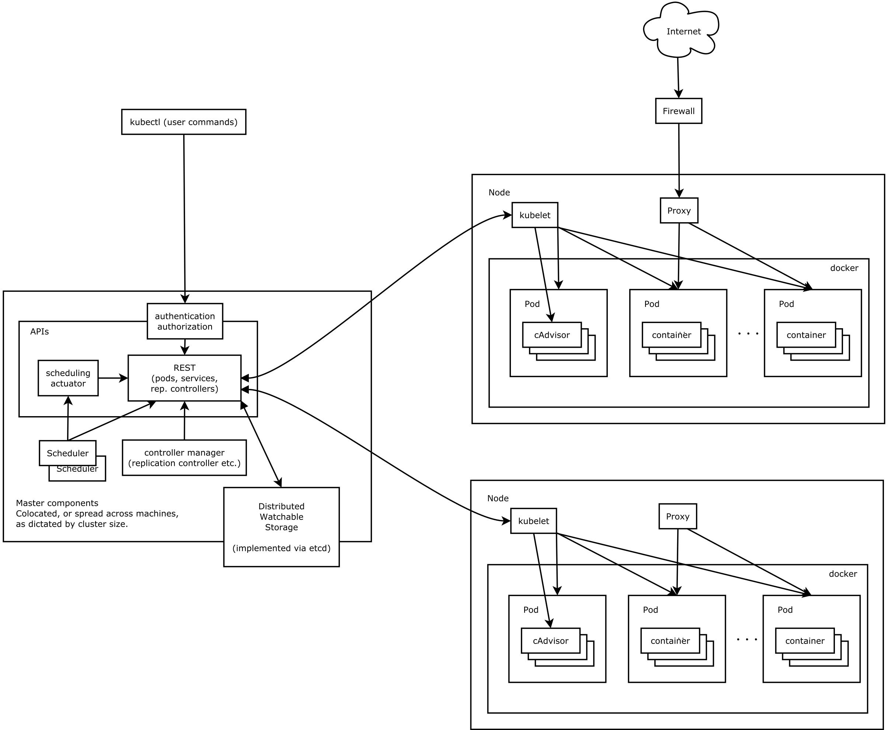

kubernetes主要由以下几个核心组件组成：
etcd: 集群的主数据库，保存了整个集群的状态; etcd负责节点间的服务发现和配置共享。etcd分布式键值存储系统, 用于保持集群状态，比如Pod、Service等对象信息。
kube-apiserver: 提供了资源操作的唯一入口，并提供认证、授权、访问控制、API注册和发现等机制；这是kubernetes API，作为集群的统一入口，各组件协调者，以HTTPAPI提供接口服务，所有对象资源的增删改查和监听操作都交给APIServer处理后再提交给Etcd存储。
kube-controller-manager: 负责维护集群的状态，比如故障检测、自动扩展、滚动更新等；它用来执行整个系统中的后台任务，包括节点状态状况、Pod个数、Pods和Service的关联等, 一个资源对应一个控制器，而ControllerManager就是负责管理这些控制器的。
kube-scheduler: 资源调度，按照预定的调度策略将Pod调度到相应的机器上；它负责节点资源管理，接受来自kube-apiserver创建Pods任务，并分配到某个节点。它会根据调度算法为新创建的Pod选择一个Node节点。
kubectl: 客户端命令行工具，将接受的命令格式化后发送给kube-apiserver，作为整个系统的操作入口。
kubelet: 负责维护容器的生命周期，负责管理pods和它们上面的容器，images镜像、volumes、etc。同时也负责Volume（CVI）和网络（CNI）的管理；kubelet运行在每个计算节点上，作为agent，接受分配该节点的Pods任务及管理容器，周期性获取容器状态，反馈给kube-apiserver; kubelet是Master在Node节点上的Agent，管理本机运行容器的生命周期，比如创建容器、Pod挂载数据卷、下载secret、获取容器和节点状态等工作。kubelet将每个Pod转换成一组容器。
container runtime: 负责镜像管理以及Pod和容器的真正运行（CRI）；
kube-proxy: 负责为Service提供cluster内部的服务发现和负载均衡；它运行在每个计算节点上，负责Pod网络代理。定时从etcd获取到service信息来做相应的策略。它在Node节点上实现Pod网络代理，维护网络规则和四层负载均衡工作。
docker或rocket(rkt): 运行容器。

除了上面的几个核心组建, 还有一些常用插件(Add-ons)：
kube-dns: 负责为整个集群提供DNS服务;
Ingress Controller: 为服务提供外网入口;
Heapster: 提供资源监控;
Dashboard: 提供GUI;
Federation: 提供跨可用区的集群;
Fluentd-elasticsearch: 提供集群日志采集、存储与查询;

其中:
master组件包括: kube-apiserver, kube-controller-manager, kube-scheduler;
Node组件包括: kubelet, kube-proxy, docker或rocket(rkt);
第三方服务：etcd

Kubernetes Master控制组件，调度管理整个系统（集群），包含如下组件:
Kubernetes API Server: 作为Kubernetes系统入口，其封装了核心对象的增删改查操作，以RESTful API接口方式提供给外部客户和内部组件调用,维护的REST对象持久化到Etcd中存储。
Kubernetes Scheduler: 为新建立的Pod进行节点(node)选择(即分配机器)，负责集群的资源调度。组件抽离，可以方便替换成其他调度器。
Kubernetes Controller: 负责执行各种控制器，目前已经提供了很多控制器来保证Kubernetes的正常运行。
Replication Controller: 管理维护Replication Controller，关联Replication Controller和Pod，保证Replication Controller定义的副本数量与实际运行Pod数量一致。
Node Controller: 管理维护Node，定期检查Node的健康状态，标识出(失效|未失效)的Node节点。
Namespace Controller: 管理维护Namespace，定期清理无效的Namespace，包括Namesapce下的API对象，比如Pod、Service等。
Service Controller: 管理维护Service，提供负载以及服务代理。
EndPoints Controller: 管理维护Endpoints，关联Service和Pod，创建Endpoints为Service的后端，当Pod发生变化时，实时更新Endpoints  (即Pod Ip + Container Port)。
Service Account Controller: 管理维护Service Account，为每个Namespace创建默认的Service Account，同时为Service Account创建Service Account Secret。
Persistent Volume Controller: 管理维护Persistent Volume和Persistent Volume Claim，为新的Persistent Volume Claim分配Persistent Volume进行绑定，为释放的Persistent Volume执行清理回收。
Daemon Set Controller: 管理维护Daemon Set，负责创建Daemon Pod，保证指定的Node上正常的运行Daemon Pod。
Deployment Controller: 管理维护Deployment，关联Deployment和Replication Controller，保证运行指定数量的Pod。当Deployment更新时，控制实现Replication Controller和　Pod的更新。
Job Controller: 管理维护Job，为Jod创建一次性任务Pod，保证完成Job指定完成的任务数目
Pod Autoscaler Controller: 实现Pod的自动伸缩，定时获取监控数据，进行策略匹配，当满足条件时执行Pod的伸缩动作。
